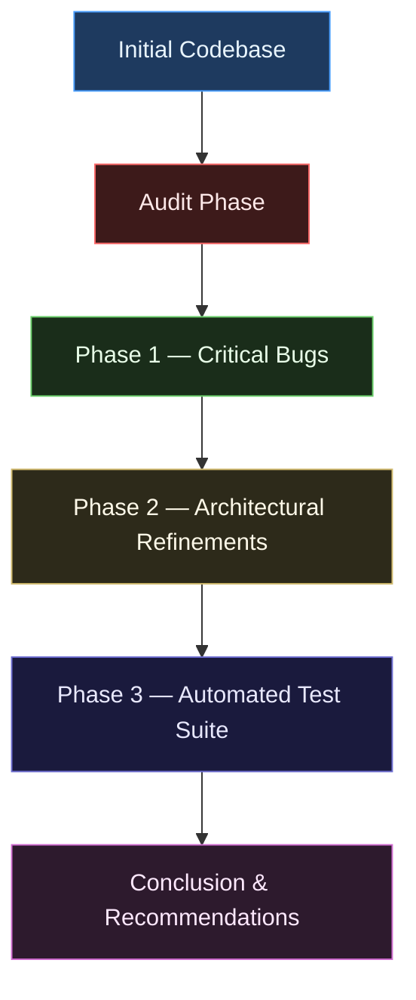
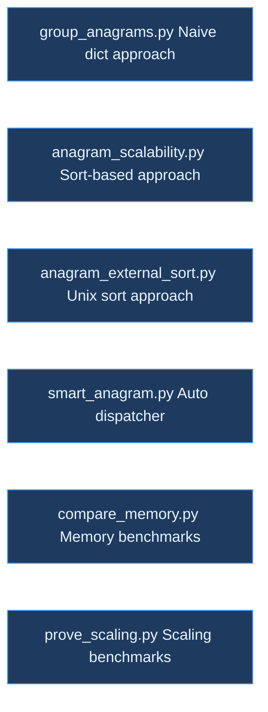
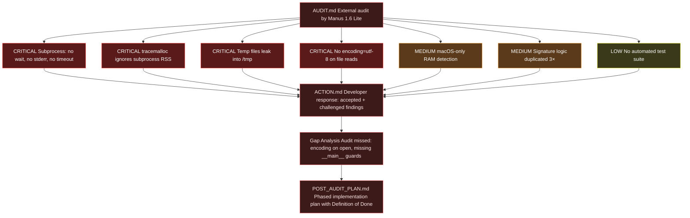
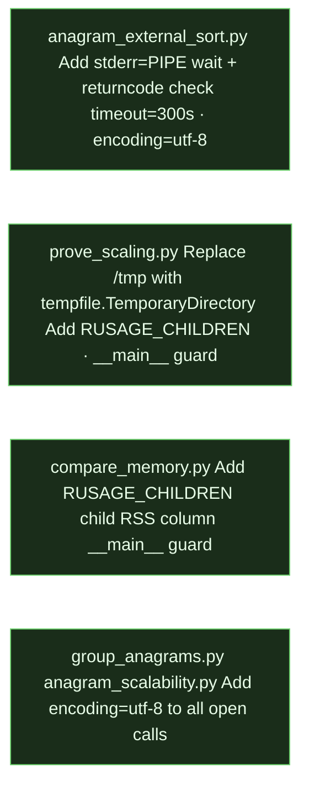
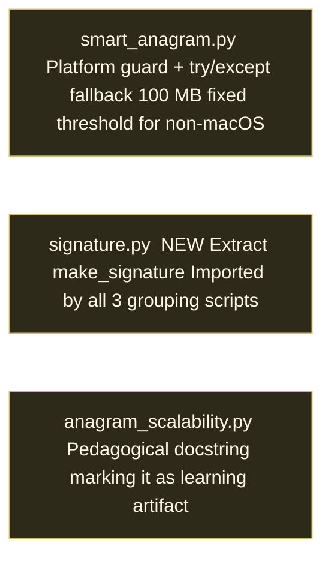
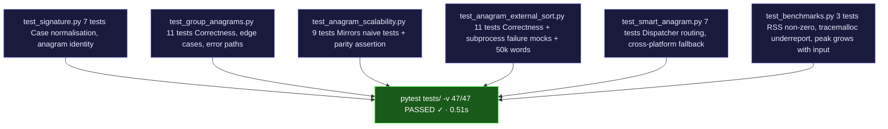
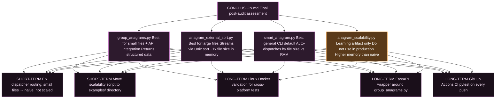

# Project Roadmap — mediasense-anagram

Full journey from initial implementation through external audit, phased remediation, and final assessment.

---

## Overview

---

## Initial Codebase

---

## Audit Phase

---

## Phase 1 — Critical Bugs

> Branch: `main` · Commit: `12fd34e`

---

## Phase 2 — Architectural Refinements

> Branch: `main` · Commit: `1984856`

---

## Phase 3 — Automated Test Suite

> Branch: `feat/test-suite` · Commit: `ccf7054` · PR: [Pinkish-Warrior/mediasense-anagram#1](https://github.com/Pinkish-Warrior/mediasense-anagram/pull/1)

---

## Conclusion & Recommendations

