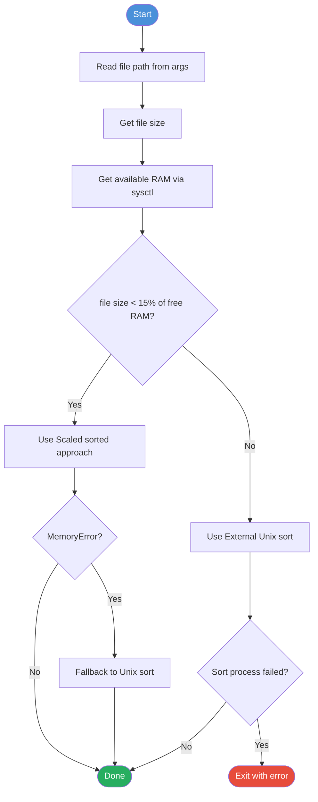

# Approach: Grouping Anagrams at Scale

## The Problem

Given a file of words (one per line), group all anagrams together. Two words are anagrams if they contain the same letters in any order (e.g. `car` and `arc`).

The challenge is doing this efficiently as file size grows — from a few bytes to hundreds of megabytes.

---

## The Journey

### Stage 1 — Naive (dictionary in RAM)

The first approach builds a dictionary in memory. Each word is sorted into a signature (e.g. `car` → `acr`) and used as a key:

```python
groups = defaultdict(list)
for word in file:
    key = "".join(sorted(word.lower()))
    groups[key].append(word)
```

**Works well for:** small files  
**Problem:** loads everything into RAM. A 262 MB file explodes to ~4.4 GB in memory due to Python object overhead — over half of an 8 GB machine.

---

### Stage 2 — Scaled (sort and stream)

Instead of a dictionary, sort all `(signature, word)` pairs and stream through them with `groupby`:

```python
pairs = sorted(stream_signatures(file_path), key=lambda x: x[0])
for _, group in groupby(pairs, ...):
    ...
```

**Better than naive?** Marginally — same ballpark memory because `sorted()` still holds all pairs in RAM before sorting.  
**Problem:** on a 262 MB file, the OS killed the process before it finished.

---

### Stage 3 — External (Unix sort)

Delegate the sort to the OS. Python feeds words in one at a time via a subprocess pipe; Unix `sort` handles the data in disk-based chunks (external merge sort). Python only ever holds one line going in and one group coming out:

```python
sort_process = subprocess.Popen(["sort"], stdin=PIPE, stdout=PIPE)
for word in file:
    sort_process.stdin.write(f"{signature}\t{word}\n")
# stream grouped output back
for _, group in groupby(sort_process.stdout, ...):
    ...
```

**Memory profile on a 262 MB file (8 GB machine):**

| Approach | Peak RAM | vs File Size | Result |
|---|---|---|---|
| Naive (dict) | 4,412 MB | 17x | Completed |
| Scaled (sorted) | 5,451 MB | 21x | Completed |
| External (Unix sort) | 275 MB | ~1x | Completed |

Scaled was actually worse than Naive — it builds all `(signature, word)` tuples in memory before sorting, adding overhead on top of what the dictionary approach already needs. External sort peaked at roughly the file size itself, the subprocess pipe buffer holding sorted output temporarily before Python reads it.

---

### Stage 4 — Smart Dispatcher

With real benchmark data, the right threshold became clear: if the file is larger than ~15% of available RAM, use Unix sort. Otherwise, scaled is faster with less subprocess overhead.

The dispatcher (`smart_anagram.py`) checks this at runtime:

```python
if file_size < available_ram * 0.15:
    use scaled
else:
    use unix sort  # with fallback if sort process fails
```

It also catches `MemoryError` on the scaled path and automatically falls back to Unix sort if the estimate was wrong.

---

## Workflow



---

## Further Reading

For the full story behind these decisions — including benchmark results, Python object overhead analysis, and the lessons learned — see [CONCLUSION.md](CONCLUSION.md).
