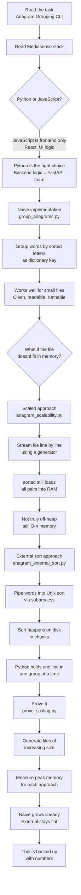

# Trajectory

```mermaid
flowchart TD
    A[Read the task<br/>Anagram Grouping CLI] --> B[Read Mediasense stack]

    B --> C{Python or JavaScript?}

    C -->|JavaScript is frontend only<br/>React, UI logic| D[Python is the right choice<br/>Backend logic = FastAPI team]

    D --> E[Naive implementation<br/>group_anagrams.py]

    E --> E1[Group words by sorted letters<br/>as dictionary key]
    E1 --> E2[Works well for small files<br/>Clean, readable, runnable]

    E2 --> F{What if the file<br/>doesnt fit in memory?}

    F --> G[Scaled approach<br/>anagram_scalability.py]

    G --> G1[Stream file line by line<br/>using a generator]
    G1 --> G2[sorted still loads<br/>all pairs into RAM]
    G2 --> G3[Not truly off-heap<br/>still O-n memory]

    G3 --> H[External sort approach<br/>anagram_external_sort.py]

    H --> H1[Pipe words into Unix sort<br/>via subprocess]
    H1 --> H2[Sort happens on disk<br/>in chunks]
    H2 --> H3[Python holds one line in<br/>one group at a time]

    H3 --> I[Prove it<br/>prove_scaling.py]

    I --> I1[Generate files of<br/>increasing size]
    I1 --> I2[Measure peak memory<br/>for each approach]
    I2 --> I3[Naive grows linearly<br/>External stays flat]

    I3 --> J[Thesis backed up<br/>with numbers]
```
